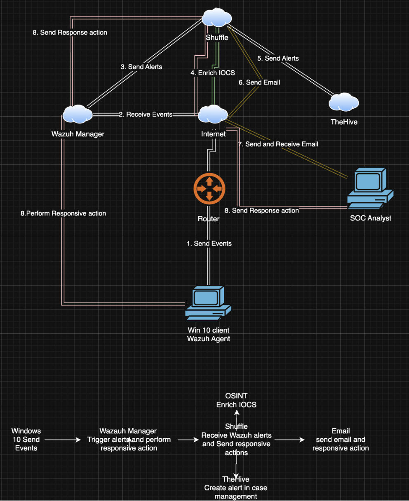
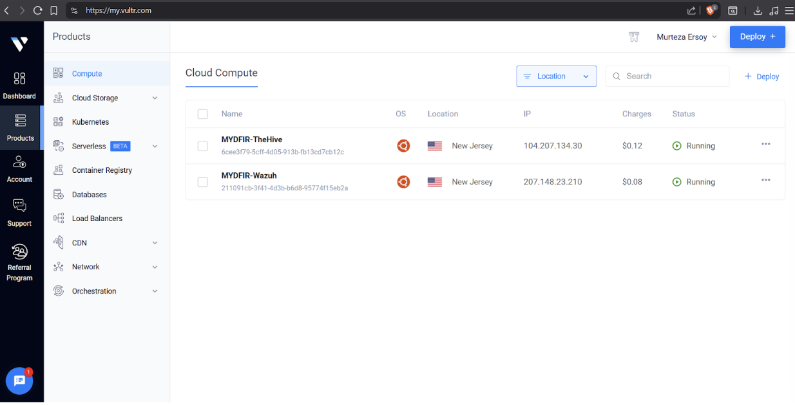
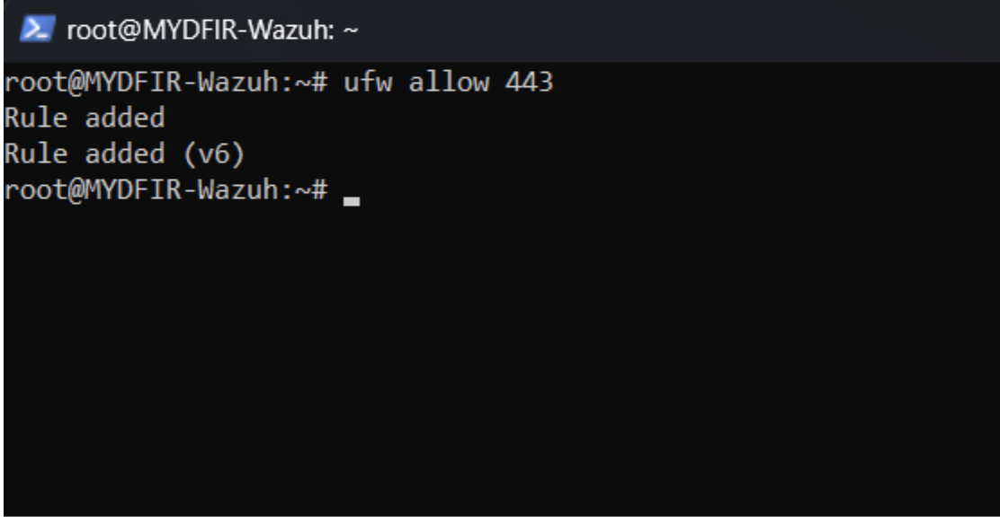
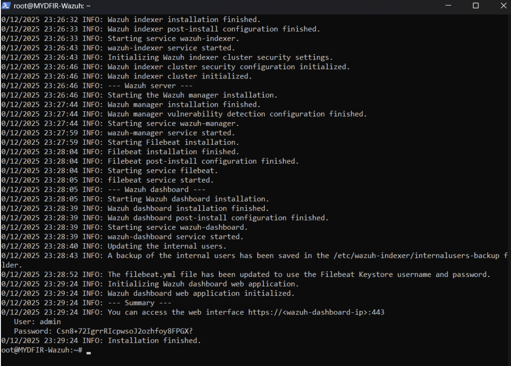
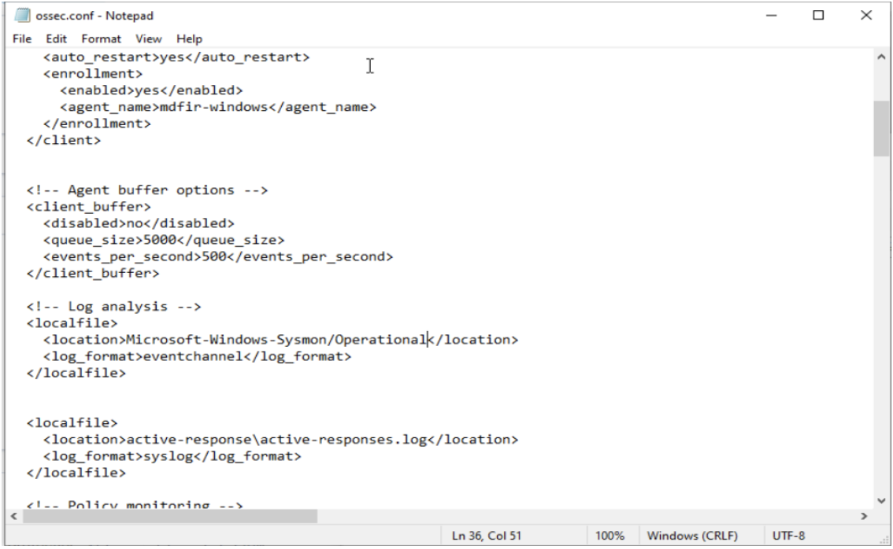
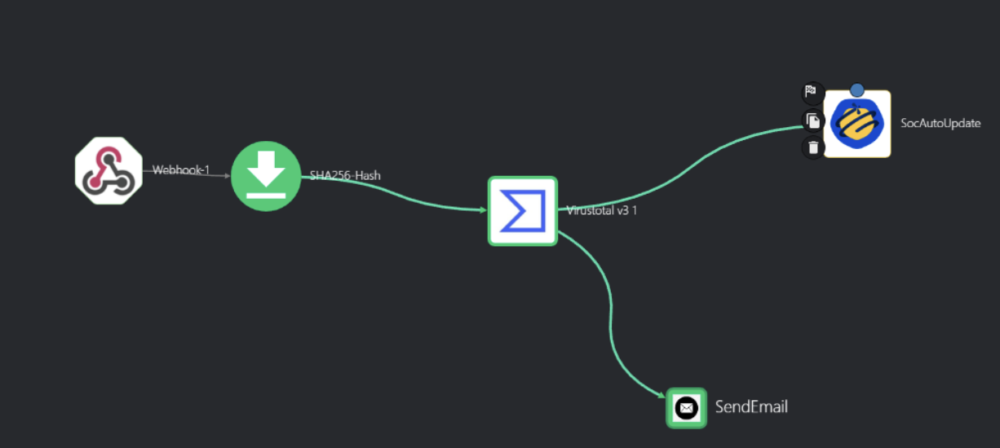
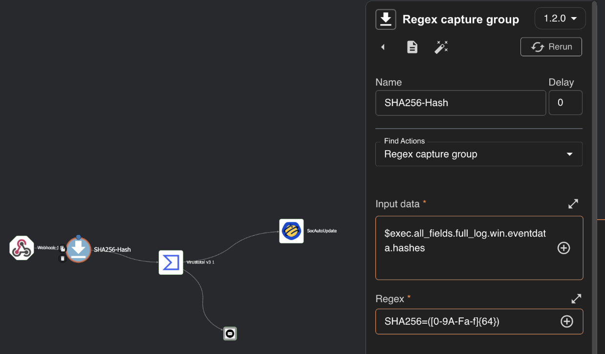
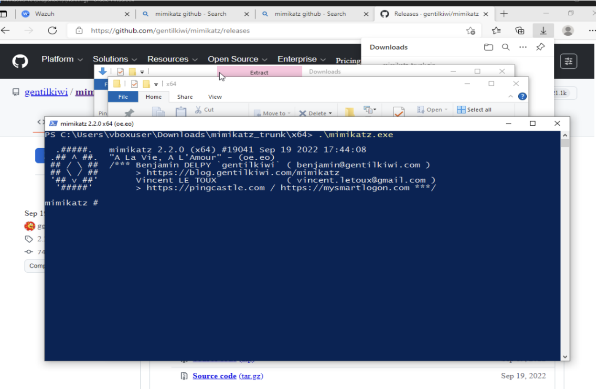
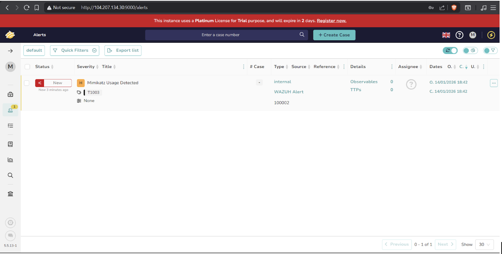
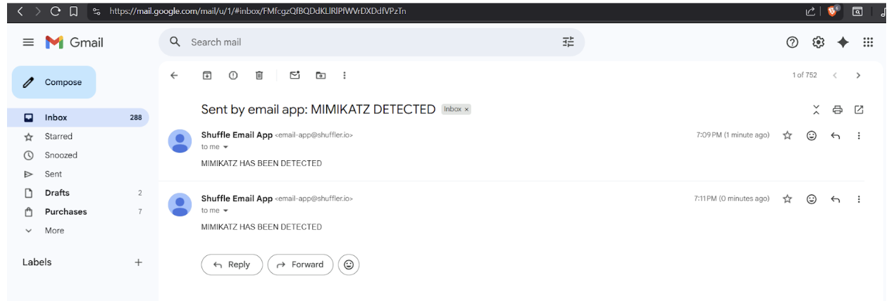

# SOC Automation Lab – Wazuh, TheHive & Shuffle

## Overview

This project implements a cloud-based SOC architecture where Wazuh functions as the SIEM and endpoint monitoring platform, TheHive is used for incident and case management, and Shuffle provides automated SOAR workflows for alert enrichment and response.

A simulated credential-dumping attack using Mimikatz was detected, enriched with threat intelligence, and automatically escalated without manual intervention.

---

## Architecture

- **Wazuh** – SIEM and endpoint monitoring  
- **Sysmon** – Enhanced Windows telemetry  
- **TheHive** – Incident and case management  
- **Shuffle** – SOAR automation and alert enrichment  
- **VirusTotal** – Threat intelligence enrichment  
- **Email** – Automated alert notification  

---

## Environment

Cloud-hosted Ubuntu-based instances were provisioned on Vultr to host the Wazuh Manager and TheHive services. Firewall rules were configured using UFW to allow secure web access over port 443.

- Ubuntu cloud instances (Vultr)
- Windows 10 endpoint with Wazuh Agent and Sysmon installed
- Secure access via HTTPS (443)

---

## Configuration & Endpoint Monitoring

The Wazuh agent was installed on a Windows 10 endpoint and integrated with Sysmon to collect detailed process creation and security telemetry. The agent’s `ossec.conf` configuration was updated to ingest Sysmon event logs, enabling enhanced detection of malicious behavior.

---

## Detection & SOC Automation Flow

Sysmon captures process execution activity on the monitored Windows endpoint and forwards the logs to Wazuh for analysis. When Mimikatz execution is detected, Wazuh generates an alert and forwards it to Shuffle for automated SOAR processing.

Within Shuffle, SHA256 file hashes are extracted using regex-based parsing and enriched by querying the VirusTotal API for threat intelligence and reputation data.

---

## Incident Response & Result

To simulate malicious credential access, Mimikatz was executed on the Windows endpoint. The activity was successfully detected by Wazuh, enriched automatically via Shuffle, and escalated through both an email alert and the creation of an incident case in TheHive.

Execution of Mimikatz on the monitored Windows endpoint to simulate credential-dumping activity.

---

## Results

- Successful detection of Mimikatz credential-dumping activity  
- Automated alert enrichment using VirusTotal  
- Automatic incident creation in TheHive  
- End-to-end SOC workflow with no manual intervention  

---

## Skills Demonstrated

- SIEM deployment and log analysis  
- Endpoint monitoring and detection engineering  
- SOAR automation and threat intelligence enrichment  
- Incident response and case management  

---

